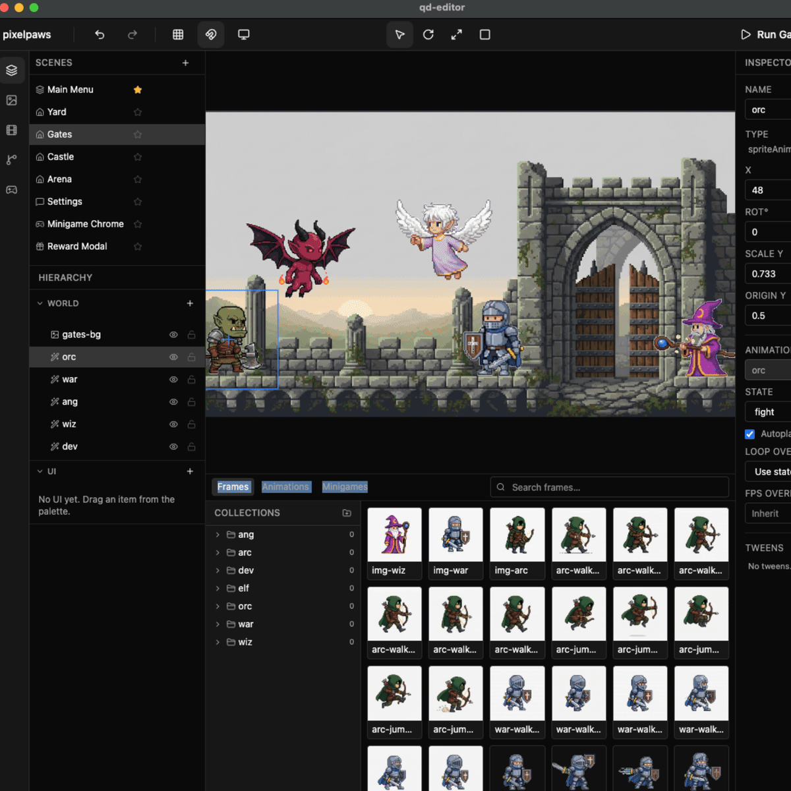

# Service Operations Copilot



Mobile-first service operations app with realtime chat and AI-driven workflows. Mobile (Expo + React Native) and web (TanStack Start PWA) clients share a single Convex backend.

Three roles — clients book and track work, workers execute jobs, managers triage and coordinate. AI runs through Convex actions over the same websocket as everything else: voice intent routing, streaming request summaries, tone-aware chat reply suggestions, and inline composer dictation.

See [`docs/service-operations-copilot-prd.md`](./docs/service-operations-copilot-prd.md) for the locked architectural decisions and phased build plan, and [`docs/ai-features.md`](./docs/ai-features.md) for the AI feature surface.

## Stack

- **Monorepo:** bun workspaces (`apps/*`, `packages/*`)
- **Mobile:** Expo SDK 55, React Native 0.83, expo-router, NativeWind 5 + Tailwind 4, Reanimated 4
- **Web:** TanStack Start + Vite + Tailwind 4, installable PWA (hand-rolled service worker, Web Push)
- **Backend:** Convex — schema, queries, mutations, actions, Better Auth (`@convex-dev/better-auth`), agent streaming (`@convex-dev/agent`)
- **AI:** Vercel AI SDK via AI Gateway (gpt-4o-mini default) + Groq Whisper for transcription
- **Shared:** zod schemas, role helpers, Tailwind theme + glass utilities in `packages/shared`

## Setup

Prerequisites: Bun ≥ 1.3, Xcode (iOS), Android Studio (Android).

```sh
bun install
```

Provision a Convex dev deployment:

```sh
bun --cwd packages/convex run dev
# follow the prompt to create the `service-ops-copilot` project
```

This writes a Convex deployment URL into `packages/convex/.env.local`. Mirror it into `apps/mobile/.env.local` and `apps/web/.env.local` as `EXPO_PUBLIC_CONVEX_URL` / `VITE_CONVEX_URL`.

Server-side secrets (auth + AI) live in `packages/convex/.env.local` but **must also** be set on the Convex deployment — `.env.local` is CLI-only:

```sh
bunx convex env set GROQ_API_KEY ...
bunx convex env set AI_GATEWAY_API_KEY ...
# plus Better Auth + OAuth secrets — see docs/ai-features.md
```

## Run

Each in its own terminal:

```sh
bun run dev:convex   # convex dev (websocket + codegen)
bun run dev:mobile   # expo start
bun run dev:web      # vite dev (TanStack Start)
```

## Seed data

Test fixtures (six requests across all statuses, with chat threads) for trying voice flows, summaries, and reply suggestions:

```sh
bun --cwd packages/convex run seed:wipe       # drop content tables (keeps users + Better Auth)
bun --cwd packages/convex run seed:populate   # load fixtures from scripts/test-users.json
```

## Quality gates

```sh
bun run check        # biome (format + lint)
bun run check:fix    # biome --write
bun run typecheck    # all workspaces
bun run test         # vitest where present (shared + convex)
```

Pre-commit hooks run biome + typecheck via lefthook. Install once:

```sh
bun run prepare
```

## Workspace layout

```
apps/
  mobile/        Expo + RN + expo-router (iOS, Android)
  web/           TanStack Start + Vite, installable PWA
packages/
  convex/        Convex deployment — schema, auth, chat, requests, AI actions, push
  shared/        zod schemas, role helpers, Tailwind theme + glass utilities
scripts/
  build-readme-header.sh   Regenerates the README GIF from a slide-deck PDF
```

## Updating the README header

The header GIF is built from a slide-deck PDF. Drop the deck at the repo root as `slides.pdf` and run:

```sh
bun run readme:header
```

Requires `pdftoppm` (poppler) and `ffmpeg` on PATH. Tune with `WIDTH`, `SECS_PER_SLIDE`, `DPI` env vars. The `slides.pdf` source is not committed — only the generated `docs/readme-header.gif` is.
